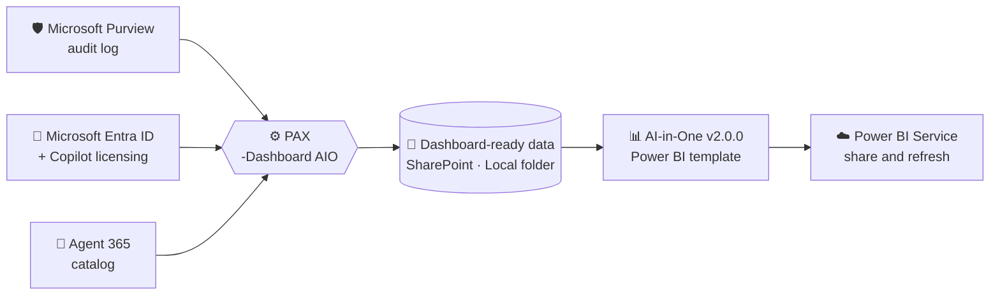
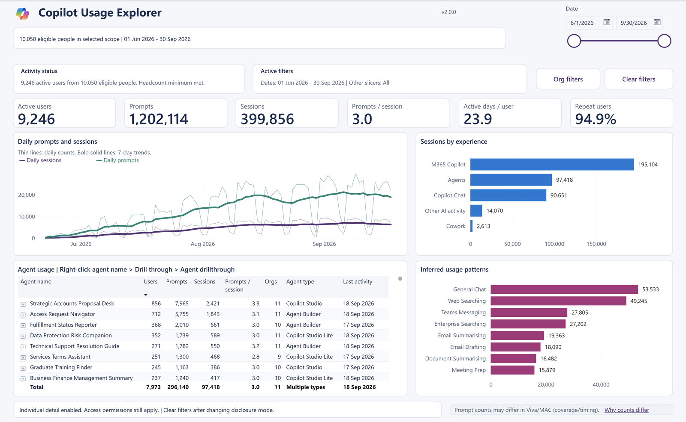
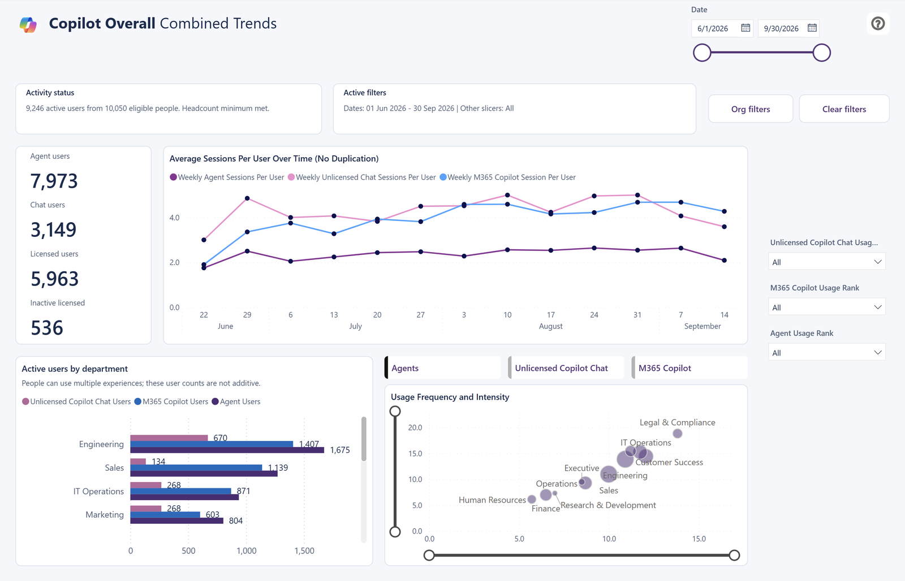
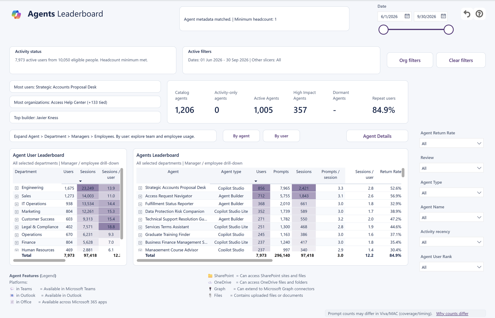
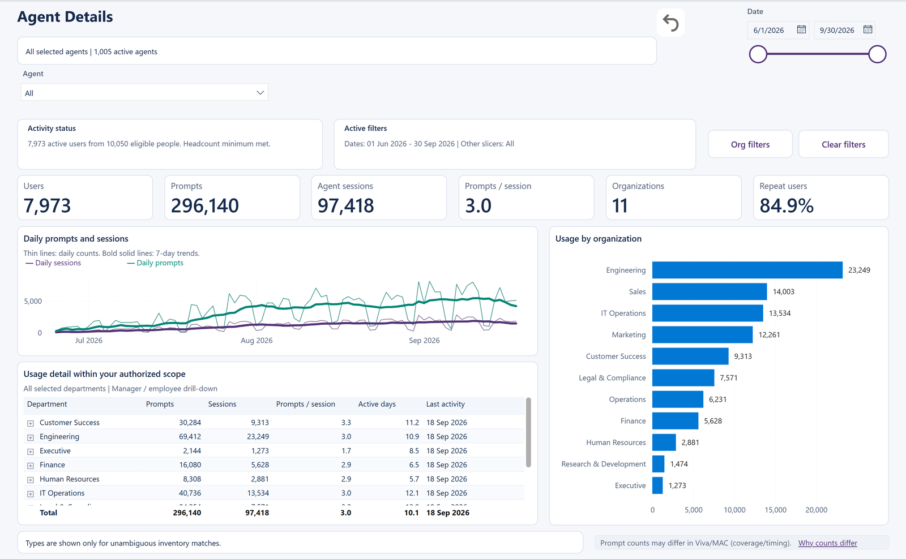
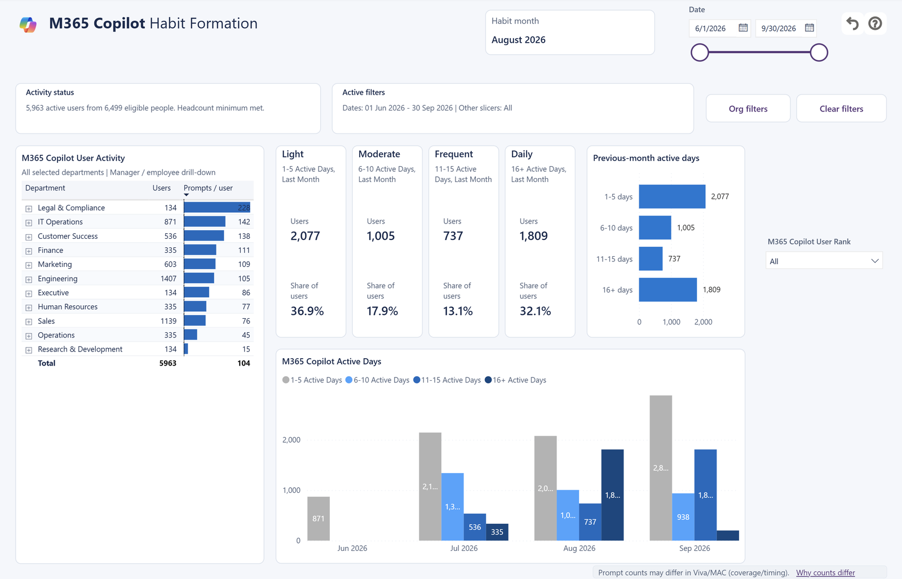
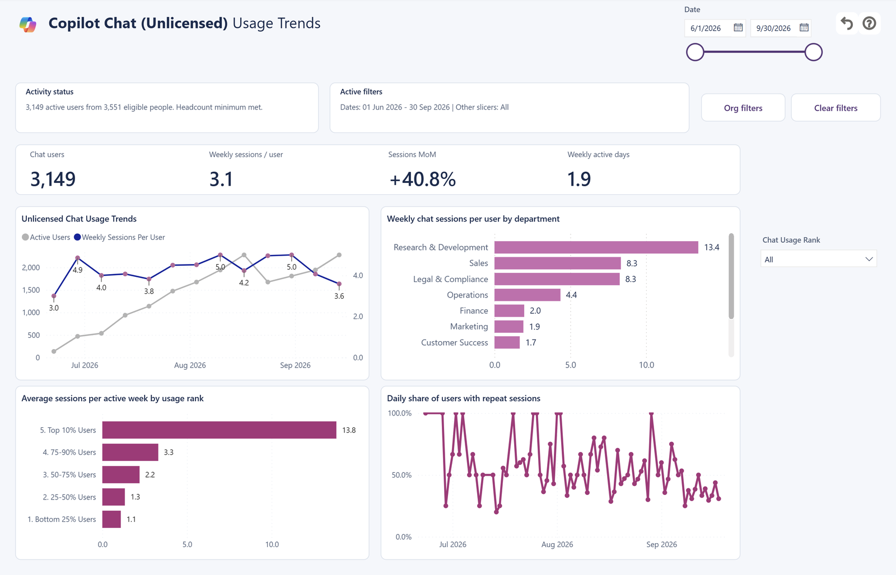
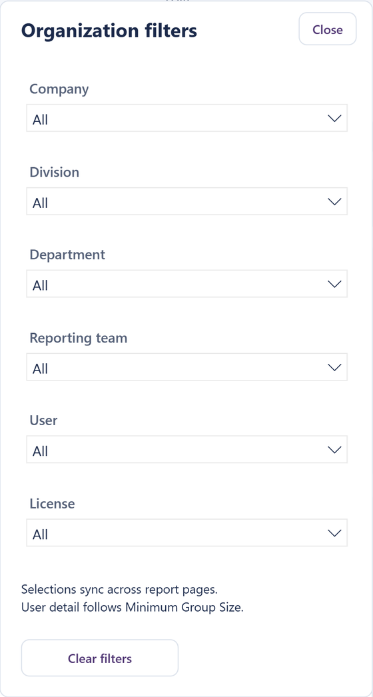
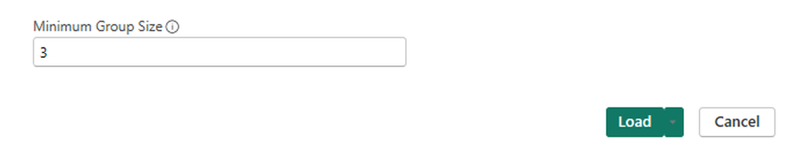
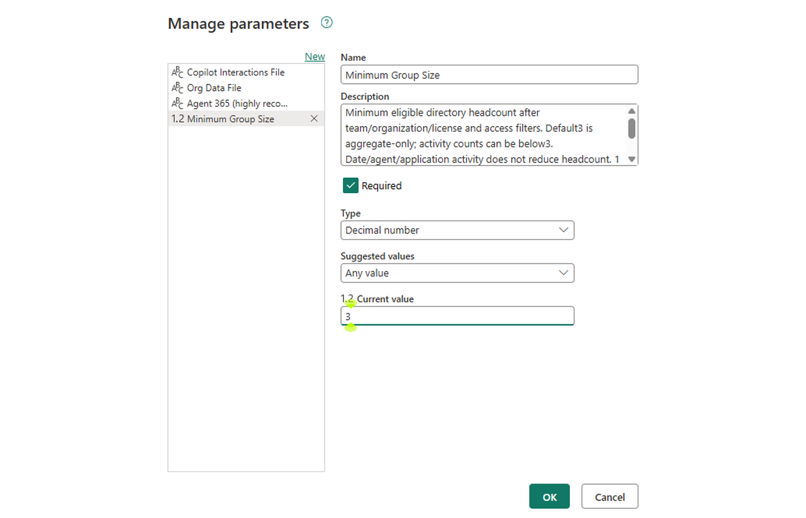

<div align="center">

# 🧠 AI-in-One Dashboard

### Every Microsoft 365 Copilot, Copilot Chat and agent signal, in one Power BI dashboard.

[](#-whats-new-in-v200)
[](#-choose-your-edition)
[](https://aka.ms/PAX)
[](https://aka.ms/Analytics-Hub)

**Built and maintained by the Microsoft Copilot Analytics team** · Free · Open source · Your data never leaves your tenant

**[⬇️ Download](#-choose-your-edition)** &nbsp;·&nbsp; **[⚡ Quick start](#-quick-start)** &nbsp;·&nbsp; **[🖼️ Screenshot tour](Report%20Screenshots.md)** &nbsp;·&nbsp; **[📘 Interpretation Guide](AI-in-One-v2.0.0-Interpretation-Guide.pdf)** &nbsp;·&nbsp; **[🎞️ Storyboard](AI-in-One-v2.0.0-Storyboard.pptx)** &nbsp;·&nbsp; **[📰 What's New](AI-in-One-v2.0.0-Whats-New.pdf)** &nbsp;·&nbsp; **[📑 Contents](#-contents)**

</div>

<a id="-watch"></a>

## 🎬 See what's new in 5 minutes

https://github.com/user-attachments/assets/e66ac19e-d4bd-45d3-85ef-485d0707c155

<sub>▶️ Plays right here with captions · 🔇 GitHub starts videos muted: select the speaker icon, or **[🔊 open it with sound](https://github.com/user-attachments/assets/e66ac19e-d4bd-45d3-85ef-485d0707c155)** · 4:56 · 📰 **[Read the What's New PDF](AI-in-One-v2.0.0-Whats-New.pdf)**</sub>

*The video is an overview. For current agent metadata definitions and the latest layouts, use the PDF and [screenshot tour](Report%20Screenshots.md).*

<a id="-whats-new-in-v200"></a>

## ✨ What's new in v2.0.0

The AI-in-One dashboard has helped many organizations understand how people use Copilot and agents. As adoption grows, so do the questions. **v2.0.0 is a major upgrade built for the next ones.**

| | |
|---|---|
| 🧭 **Copilot Usage Explorer.** A new starting page: search for any manager, choose a team or pick an agent. | 🎛️ **Org filters.** Set company, division, department, team, user and license once; your choices follow you across pages. |
| 🤖 **Agent Details.** A new page for any agent, reached from the tab or by right-clicking an agent name. | 🔒 **Minimum Group Size.** Team-level reporting by default; individual detail only when you approve it. |
| 📊 **Clearer comparisons.** Side-by-side bars, plain percentage definitions and month labels on every habit page. | 💬 **Prompts and sessions together.** See how much people ask, not just how often they start a conversation. |
| ✅ **Health Check that follows you.** Agent review figures now respect your team and date choices. | 📖 **Metric Glossary & Guide.** Definitions and reading tips for all 17 pages. |
| ⚡ **Fast loads, growing history.** PAX prepares the data first and can add each new day automatically. | 🧹 **One-click reset.** **Clear filters** resets selections and expanded tables without leaving the page. |

As customers explore new questions, v2.0.0 brings more context to those conversations: usage bands follow the selected dates and organization, licensed activity includes every recorded experience, and the relevant tables and weekly comparisons pair prompts with sessions.

📰 **Prefer to read it?** The **[What's New in v2.0.0 overview (PDF)](AI-in-One-v2.0.0-Whats-New.pdf)** walks through every change with screenshots. It's easy to share with stakeholders.

<a id="-choose-your-edition"></a>

## ⬇️ Choose your edition

All three editions provide the v2.0.0 report's 17-page experience with privacy controls and row-level security, using different data sources and refresh paths. **This preview update aligns SharePoint, Local CSV and Fabric OneLake on the same report and all 444 measures, including the latest calculation, agent-metadata and numeric-readability improvements.** Fabric OneLake retains its notebook-prepared data tier and optional SharePoint-hosted Agent 365 CSV.

Dashboard downloads are **Power BI templates (.pbit)**. Load a template in Power BI Desktop to create your report.

| | 🟦 **SharePoint** | 💻 **Local CSV** | 🟪 **Fabric OneLake** |
|---|:---:|:---:|:---:|
| **Recommended for** | Most organizations | Analysts, pilots and trials | Organizations with Microsoft Fabric capacity |
| **Reads data from** | PAX files in a SharePoint library | PAX files on your PC or a network share | Delta tables in a Fabric Lakehouse, filled by Fabric notebooks |
| **Scheduled refresh in Power BI Service** | ✅ No gateway needed | ⚙️ Needs an on-premises data gateway | ✅ No gateway needed |
| **Download** | **[SharePoint template](templates/AI-in-One-v2.0.0-SharePoint-Template.pbit)** | **[Local CSV template](templates/AI-in-One-v2.0.0-Local-CSV-Template.pbit)** | **[Fabric OneLake template](templates/AI-in-One-v2.0.0-Fabric-OneLake-Template.pbit)** |

> [!TIP]
> **Not sure?** Choose **SharePoint**: it refreshes itself on a schedule with no gateway. Choose **Local CSV** to explore in Power BI Desktop first, or when your files stay on your PC or a file share. Choose **Fabric OneLake** when your organization already runs Microsoft Fabric and wants the data in a Lakehouse.

> [!NOTE]
> **Using Fabric OneLake?** This edition doesn't use PAX. Fabric notebooks collect the data from Microsoft Graph into your Lakehouse, so follow the **[Fabric OneLake setup guide](Fabric%20OneLake/README.md)** instead of Steps 1 to 3 below, then come back to [Step 4](#-step-4-publish-share-and-refresh) to set up row-level security and share. A PAX Fabric-native solution is on the way.

<a id="-quick-start"></a>

## ⚡ Quick start



| Step | What you do | Time |
|:---:|---|---|
| **1** | **[Prepare](#-step-1-prepare):** confirm audit logging is on and that the person running PAX has the required permissions. | 10 min |
| **2** | **[Export with PAX](#-step-2-export-your-data-with-pax):** run one seed command, then add new days automatically with a watermark. | One command |
| **3** | **[Open the template](#-step-3-open-the-template):** paste the file paths, choose a Minimum Group Size and select **Load**. | 5 min |
| **4** | **[Publish and share](#-step-4-publish-share-and-refresh):** publish to Power BI Service, schedule refresh and assign the row-level security roles. | 15 min |

> [!NOTE]
> **No data yet?** Try the report first with the made-up files in [`sample-data`](sample-data/README.md).
>
> **Fabric OneLake edition?** Start with the [Fabric OneLake setup guide](Fabric%20OneLake/README.md) for Steps 1 to 3, then use [Step 4](#-step-4-publish-share-and-refresh) here.

<a id="-learn-the-dashboard"></a>

## 📚 Learn the dashboard

<table>
<tr>
<td width="33%" valign="top">

### 🖼️ [Screenshot tour](Report%20Screenshots.md)

A quick picture walkthrough of all 17 pages, in order, with what each one shows. **Start here to get your bearings.**

</td>
<td width="33%" valign="top">

### 📘 [Interpretation Guide](AI-in-One-v2.0.0-Interpretation-Guide.pdf)

How to read every page: what each number means, how filters and Minimum Group Size work, and how to turn what you see into a useful conversation. **Read it before you share the report.**

</td>
<td width="33%" valign="top">

### 🎞️ [Storyboard](AI-in-One-v2.0.0-Storyboard.pptx)

A ready-to-present walkthrough for leadership reviews, adoption councils and stakeholder briefings. **Use it to tell your adoption story.**

</td>
</tr>
</table>

<table>
<tr>
<td width="33%" align="center"><a href="Report%20Screenshots.md#page-1"></a><br><sub><b>🧭 Copilot Usage Explorer</b></sub></td>
<td width="33%" align="center"><a href="Report%20Screenshots.md#page-3"></a><br><sub><b>🔍 Combined Trends</b></sub></td>
<td width="33%" align="center"><a href="Report%20Screenshots.md#page-7"></a><br><sub><b>🤖 Agents: Leaderboard</b></sub></td>
</tr>
<tr>
<td width="33%" align="center"><a href="Report%20Screenshots.md#page-10"></a><br><sub><b>🤖 Agent Details</b></sub></td>
<td width="33%" align="center"><a href="Report%20Screenshots.md#page-12"></a><br><sub><b>📈 M365 Copilot: Habit Formation</b></sub></td>
<td width="33%" align="center"><a href="Report%20Screenshots.md#page-14"></a><br><sub><b>📊 Chat (Web): Usage Trends</b></sub></td>
</tr>
</table>

<div align="center"><b><a href="Report%20Screenshots.md">🖼️ See all 17 pages in the screenshot tour →</a></b></div>

---

<a id="-contents"></a>

## 📑 Contents

| About the dashboard | Set it up | Use it well |
|---|---|---|
| [🧠 What the dashboard is](#-what-the-dashboard-is) | [1️⃣ Prepare](#-step-1-prepare) | [🔒 Privacy and Minimum Group Size](#-privacy-and-minimum-group-size) |
| [🗺️ The 17 report pages](#-the-17-report-pages) | [2️⃣ Export your data with PAX](#-step-2-export-your-data-with-pax) | [🧭 Tips for reading the numbers](#-tips-for-reading-the-numbers) |
| [🚀 Why leaders use it](#-why-leaders-use-it) | [3️⃣ Open the template](#-step-3-open-the-template) | [🛠️ Troubleshooting](#-troubleshooting) |
| [⚠️ Usage and compliance](#-usage-and-compliance) | [4️⃣ Publish, share and refresh](#-step-4-publish-share-and-refresh) | [📧 Email your admin](#-email-your-admin) |
| [🖼️ Screenshot tour](Report%20Screenshots.md) | [🔐 Row-level security](#-row-level-security) | |

Select a section to jump to it, then expand it for the details.

---

<a id="-what-the-dashboard-is"></a>

## 🧠 What the dashboard is

<details>
<summary><b>Expand: a Power BI view of Copilot and agent activity across your organization</b></summary>

<br>

The AI-in-One dashboard is a free Power BI template that brings together three sources of information:

- **What people did:** Microsoft 365 Copilot, Copilot Chat and agent activity from the Microsoft Purview audit log.
- **Who they are:** departments, reporting lines, job titles and Copilot licensing from Microsoft Entra ID and the Microsoft 365 admin center.
- **Which agents exist:** names, types, creators, developers and status from the Agent 365 catalog.

Together, they answer the questions leaders ask most:

- Who is using Copilot, how often, and is it becoming a habit?
- Which teams are ahead, and which need more support?
- How are licensed Microsoft 365 Copilot, Copilot Chat and agents each being used?
- Which agents are people coming back to, and which need a review?
- Where would more licenses or training make the biggest difference?

[](Report%20Screenshots.md)

*The screenshots use made-up example data, not targets for your organization. **[🖼️ Take the full screenshot tour →](Report%20Screenshots.md)***

</details>

<a id="-the-17-report-pages"></a>

## 🗺️ The 17 report pages

<details>
<summary><b>Expand: every page and the question it answers</b></summary>

<br>

| Area | Page | The question it answers |
|---|---|---|
| **Start here** | [🧭 Copilot Usage Explorer](Report%20Screenshots.md#page-1) | How is my team, a manager's organization or one agent using Copilot right now? |
| **Overall** | [📊 License Prioritization](Report%20Screenshots.md#page-2) | Which groups show patterns that could support a licensing conversation? |
| | [🔍 Copilot Overall: Combined Trends](Report%20Screenshots.md#page-3) | How do M365 Copilot, Copilot Chat and agents compare over time? |
| | [🔍 Copilot Overall: Combined Leaderboard](Report%20Screenshots.md#page-4) | Which departments use each experience, and how many chat users also use agents? |
| **Agents** | [🤖 Agents: Usage Trends](Report%20Screenshots.md#page-5) | How many people try agents, and how many come back? |
| | [🤖 Agents: Habit Formation](Report%20Screenshots.md#page-6) | How often do people use agents in a month: lightly, moderately, frequently or daily? |
| | [🤖 Agents: Leaderboard](Report%20Screenshots.md#page-7) | Which agents and people lead on sessions and prompts? |
| | [🤖 Agents: Health Check](Report%20Screenshots.md#page-8) | Which agents should we keep and which should we review with their owners? |
| | [🤖 Agents: Use Cases](Report%20Screenshots.md#page-9) | What might each agent be used for? |
| | [🤖 Agent Details](Report%20Screenshots.md#page-10) | Who uses this agent, how much, where and how often do they return? |
| **M365 Copilot** | [📈 M365 Copilot: Usage Trends](Report%20Screenshots.md#page-11) | How is licensed Copilot use trending? |
| | [📈 M365 Copilot: Habit Formation](Report%20Screenshots.md#page-12) | Is licensed Copilot becoming a monthly habit? |
| | [📈 M365 Copilot: Leaderboard](Report%20Screenshots.md#page-13) | Which departments, applications and (when approved) people lead? |
| **Copilot Chat** | [📊 Chat (Web): Usage Trends](Report%20Screenshots.md#page-14) | How often do people without a Copilot license use Copilot Chat, and do they return the same day? |
| | [📊 Chat (Web): Habit Formation](Report%20Screenshots.md#page-15) | Is Copilot Chat becoming a habit? |
| | [📊 Chat (Web): Leaderboard](Report%20Screenshots.md#page-16) | Who leads on prompts and conversations, and when were they last active? |
| **Reference** | [📖 Metric Glossary & Guide](Report%20Screenshots.md#page-17) | What does this number mean, and how should I read it? |

🖼️ **Select any page name to see its screenshot in the [Screenshot tour](Report%20Screenshots.md).**

<table>
<tr>
<td width="30%" valign="top">



</td>
<td width="70%" valign="top">

**Moving around the report**

- Open **Org filters** on any analytical page to set company, division, department, reporting team, user and license. Your choices carry across pages.
- In **Reporting team**, search for a manager's name to include their whole organization: direct and indirect reports, without the manager's own record.
- Right-click an agent name and choose **Drill through → Agent drillthrough** to open that agent's details.
- **Clear filters** resets selections and expanded tables. In Power BI Desktop, hold **Ctrl** while clicking report buttons.

</td>
</tr>
</table>

</details>

<a id="-why-leaders-use-it"></a>

## 🚀 Why leaders use it

<details>
<summary><b>Expand: real ways executives and stakeholders use the dashboard</b></summary>

<br>

The dashboard turns scattered activity records into a shared, trusted picture that everyone from the CIO to an agent owner can act on.

| Who | What they want to know | Where to look | What they do next |
|---|---|---|---|
| **CIO / CTO** | Is our Copilot investment being used broadly, and is use growing? | Combined Trends, M365 Copilot: Usage Trends | Report adoption to the board with month-over-month trends instead of anecdotes. |
| **CFO / licensing owner** | Where would more licenses, or a different license mix, have the most impact? | License Prioritization, Chat (Web) pages | Find departments with heavy Copilot Chat use and no license, and start a business-case conversation with their leaders. |
| **Business unit leader** | How is *my* organization doing compared with the rest of the company? | Copilot Usage Explorer, Org filters | Search for their own name in **Reporting team**, compare the team's seven-day trend before and after a rollout, and celebrate the teams that lead. |
| **Adoption and change lead** | Is Copilot becoming a habit, or did people try it once and stop? | Habit Formation pages | Target training at groups that are stuck at 1–5 active days a month, then check next month whether they moved into a higher range. |
| **Agent owner / Center of Excellence** | Which agents earn repeat use, and which should be retired or improved? | Agents: Health Check, Agent Details, Use Cases | Use **Keep** and **Review** labels to plan agent reviews, invest in agents people return to, and tidy up ones nobody uses. |
| **HR, privacy and works councils** | Is reporting appropriately protected? | Minimum Group Size, Metric Glossary | Confirm reporting stays at team level by default; individual detail appears only after an approved change. |
| **Microsoft account teams and partners** | How can we help this customer succeed with Copilot? | The full report and the [Storyboard](AI-in-One-v2.0.0-Storyboard.pptx) | Run a data-backed adoption review, agree on the next three enablement actions, and measure progress at the next meeting. |

> ❗ **Important:** Activity shows **where to start a conversation**. It doesn't prove time saved, answer quality, business value or individual performance.

</details>

---

<a id="-step-1-prepare"></a>

## 1️⃣ Step 1: Prepare

<details>
<summary><b>Expand: audit logging, permissions and software</b></summary>

<br>

### ✅ Turn on unified audit logging

Every number in the dashboard comes from the Microsoft Purview unified audit log. It is on by default in most tenants, but it is often off in demo, development and new tenants. If it is off, every audit query fails with `"Status":"AuditingDisabledTenant"`.

- **In the portal:** open [purview.microsoft.com/audit/auditsearch](https://purview.microsoft.com/audit/auditsearch). If you see **Start recording user and admin activity**, select it.
- **In PowerShell:**

  ```powershell
  Connect-ExchangeOnline -Organization contoso.onmicrosoft.com
  Set-AdminAuditLogConfig -UnifiedAuditLogIngestionEnabled $true
  (Get-AdminAuditLogConfig).UnifiedAuditLogIngestionEnabled   # expect: True
  ```

> ⚠️ **Warning:** Turning on audit logging doesn't recover the past. Records start from that moment and can take up to 24 hours to appear, so a first export after turning it on will look sparse.

### 🔑 Microsoft Graph permissions for PAX

PAX needs **Microsoft Graph API permissions only**, and only for the features a run uses. Grant them as **delegated** permissions when you sign in yourself, or as **application** permissions (with admin consent) for an app registration or managed identity. The names are the same either way.

| Needed when | Microsoft Graph permission |
|---|---|
| Every run (Copilot and agent activity) | `AuditLogsQuery.Read.All` |
| Every AI-in-One run (people, departments and licensing) | `User.Read.All` and `Organization.Read.All` |
| Collecting the Agent 365 catalog (recommended) | `CopilotPackages.Read.All` and `Application.Read.All` |
| Saving to SharePoint | `Sites.Selected` *(recommended)*, plus a one-time grant to the target site. See below. |
| Filtering to security groups with `-GroupNames` | `GroupMember.Read.All` |

<a id="-sharepoint-site-access"></a>

**Saving to SharePoint with `Sites.Selected`.** `Sites.Selected` gives the app registration or managed identity access to **no** sites until an admin grants it one. An admin runs this once with [Microsoft Graph PowerShell](https://aka.ms/graph/sdk/powershell), signing in with the Graph permission `Sites.FullControl.All`:

**1. Sign in and find the site's ID.** Use the host name, a colon, then the site path:

```powershell
Connect-MgGraph -Scopes "Sites.FullControl.All"
Get-MgSite -SiteId "contoso.sharepoint.com:/sites/CopilotAnalytics" | Select-Object Id, WebUrl
```

**2. Grant write access to that site only.** Paste the site **Id** from step 1, and the **Application (client) ID** of the app registration or managed identity that runs PAX:

```powershell
New-MgSitePermission -SiteId "contoso.sharepoint.com,11111111-1111-1111-1111-111111111111,22222222-2222-2222-2222-222222222222" -BodyParameter @{
    roles               = @("write")
    grantedToIdentities = @(@{ application = @{ id = "33333333-3333-3333-3333-333333333333"; displayName = "PAX" } })
}
```

Repeat for each site PAX writes to. When you run PAX interactively instead, PAX requests `Sites.ReadWrite.All` at sign-in, which can only reach sites your own account can already edit.

The [PAX documentation](https://aka.ms/PAX) covers each sign-in option, including app registrations and managed identities for unattended runs.

### 💻 Software

- **[PowerShell 7 or later](https://aka.ms/powershell)** to run PAX.
- **[Python 3.10 or later](https://python.org/downloads)**, which PAX uses to prepare the dashboard files. If it's missing, PAX installs it on first use.
- **[Power BI Desktop](https://aka.ms/pbidesktop)** to open the template.
- A **SharePoint document library** or a **local or network folder** for the output.

</details>

<a id="-step-2-export-your-data-with-pax"></a>

## 2️⃣ Step 2: Export your data with PAX

<details>
<summary><b>Expand: PAX, Mini-Kitchen, and the seed and watermark commands</b></summary>

<br>

> 💡 **Tip:** **Use [PAX](https://aka.ms/PAX), Microsoft's free Portable Audit eXporter.** It collects activity, people, licensing and agent data in one run and writes files that are ready for this dashboard. Prefer not to type commands? **[⌨️ Mini-Kitchen](https://PAXcookbook.com/Mini-Kitchen)** builds them for you.

### ⚙️ Why PAX

| | |
|---|---|
| 🧩 **One run, every input.** Copilot and agent activity, people and licensing, and the Agent 365 catalog, all from one command. | ⚡ **Dashboard-ready output.** `-Dashboard AIO` prepares compact files before Power BI reads them, so reports load fast. |
| 📈 **History that grows itself.** A watermark adds only the days you don't have yet, with no gaps and no double counting. | ☁️ **Save where you work.** Write to a SharePoint library or to a local or network folder. |
| 🛟 **Built for big tenants.** Checkpoint and resume, parallel collection and adaptive time-slicing keep long exports on track. | 🛡️ **Protects your history.** Every file is checked before and after it is replaced, so a failed run never leaves you with half a dataset. |
| 🔐 **Optional de-identification.** `-Deidentify` replaces names and other identifiers with consistent stand-ins. | 🆓 **Free and open source.** Published by Microsoft on [GitHub](https://aka.ms/PAX). |

Download the latest PAX script and its documentation from **[aka.ms/PAX](https://aka.ms/PAX)**.

### ⌨️ Build your command with Mini-Kitchen

**[Mini-Kitchen](https://PAXcookbook.com/Mini-Kitchen)** builds a clean, copy-ready PAX command in your browser. Choose the **AI-in-One** preset, pick your dates and where to save the files, then copy the command and run it yourself.

- **Nothing to install.** It runs in your browser.
- **Never touches your tenant.** No sign-in, no credentials and no access to your audit, user or file data.
- **Saves your choices.** Keep recipes in your browser and come back to them next time.

### 🌱 Seed once, then keep it current

| | What it does | How often |
|---|---|---|
| **🌱 Seed** | Collects your starting history, for example the last 90 days, and creates the dashboard data. | **Once** |
| **💧 Keep it current** | Adds new days to the **same** data, so the template's paths never change. | **Daily or weekly, on a schedule** |

`-Dashboard AIO` prepares the AI-in-One data. Every output gets its own destination: activity (`-OutputPath`), people and licensing (`-OutputPathUserInfo`) and the Agent 365 catalog (`-OutputPathAgent365Info`). Watermark runs then use the matching `-AppendFile`, `-AppendUserInfo` and `-AppendAgent365Info` switches. Replace the example paths, dates and file names with your own, and replace `PAX_Purview_Audit_Log_Processor_v2.0.0.ps1` with the file name of the PAX script you downloaded.

Choose where the data should live:

<details>
<summary><b>🟦 SharePoint library</b> &nbsp;·&nbsp; for the SharePoint edition (recommended)</summary>

<br>

**🌱 Seed: run once**

```powershell
pwsh -NoProfile -ExecutionPolicy Bypass -File .\PAX_Purview_Audit_Log_Processor_v2.0.0.ps1 `
    -Dashboard AIO -IncludeUserInfo -IncludeAgent365Info `
    -StartDate 2026-07-01 -EndDate 2026-10-01 `
    -OutputPath             "https://contoso.sharepoint.com/sites/CopilotAnalytics/Shared Documents/PAX/AIO" `
    -OutputPathUserInfo     "https://contoso.sharepoint.com/sites/CopilotAnalytics/Shared Documents/PAX/AIO" `
    -OutputPathAgent365Info "https://contoso.sharepoint.com/sites/CopilotAnalytics/Shared Documents/PAX/AIO"
```

The library folder then holds three files, one for each template parameter:

- **Copilot Interactions File:** `AIO_Purview_Audit_UsageActivity_CopilotInteraction_<timestamp>_Interactions.csv`
- **Org Data File:** `AIO_EntraUsers_MAClicensing_<timestamp>_Users.csv`
- **Agent 365:** `Agent365_<timestamp>.csv`

**💧 Keep it current: schedule this**

Point each append switch at the matching seed file, using the file names exactly as they appear. The seed records where it ended, so every run picks up from there automatically.

```powershell
pwsh -NoProfile -ExecutionPolicy Bypass -File .\PAX_Purview_Audit_Log_Processor_v2.0.0.ps1 `
    -Dashboard AIO -Watermark `
    -AppendFile         "https://contoso.sharepoint.com/sites/CopilotAnalytics/Shared Documents/PAX/AIO/AIO_Purview_Audit_UsageActivity_CopilotInteraction_20261001_020000_Interactions.csv" `
    -AppendUserInfo     "https://contoso.sharepoint.com/sites/CopilotAnalytics/Shared Documents/PAX/AIO/AIO_EntraUsers_MAClicensing_20261001_020000_Users.csv" `
    -AppendAgent365Info "https://contoso.sharepoint.com/sites/CopilotAnalytics/Shared Documents/PAX/AIO/Agent365_20261001_020000.csv"
```

> ❗ **Important:** Copy SharePoint folder and file paths from the **Details** pane: select the item, choose **⋮ → Details**, then copy **Path**. Viewer or sharing links, such as addresses containing `?`, `/:x:/r/` or `&web=1`, won't work.

</details>

<details>
<summary><b>💻 Local or network folder</b> &nbsp;·&nbsp; for the Local CSV edition</summary>

<br>

**🌱 Seed: run once**

```powershell
pwsh -NoProfile -ExecutionPolicy Bypass -File .\PAX_Purview_Audit_Log_Processor_v2.0.0.ps1 `
    -Dashboard AIO -IncludeUserInfo -IncludeAgent365Info `
    -StartDate 2026-07-01 -EndDate 2026-10-01 `
    -OutputPath             "C:\PAX\AIO\" `
    -OutputPathUserInfo     "C:\PAX\AIO\" `
    -OutputPathAgent365Info "C:\PAX\AIO\"
```

`C:\PAX\AIO\` then holds the same three files as the SharePoint example.

**💧 Keep it current: schedule this**

```powershell
pwsh -NoProfile -ExecutionPolicy Bypass -File .\PAX_Purview_Audit_Log_Processor_v2.0.0.ps1 `
    -Dashboard AIO -Watermark `
    -AppendFile         "C:\PAX\AIO\AIO_Purview_Audit_UsageActivity_CopilotInteraction_20261001_020000_Interactions.csv" `
    -AppendUserInfo     "C:\PAX\AIO\AIO_EntraUsers_MAClicensing_20261001_020000_Users.csv" `
    -AppendAgent365Info "C:\PAX\AIO\Agent365_20261001_020000.csv"
```

</details>

<details>
<summary><b>💡 How the dates and watermark work</b></summary>

<br>

- **Dates are whole UTC days.** `-StartDate` is the first day collected. `-EndDate` is the day collection stops *before*. So `-StartDate 2026-07-01 -EndDate 2026-10-01` collects July 1 through September 30.
- **No gaps, no overlap.** The seed records where it ended, so the first watermark run starts on the seed's `-EndDate` (here `2026-10-01`) automatically.
- **Watermark runs pick their own dates.** Don't add `-StartDate` or `-EndDate`. Each run collects every whole day since the last one, up to the start of today (UTC).
- **Already current?** PAX says so and finishes without contacting any service.
- **Overlap is safe.** If a day is collected twice, PAX removes the duplicates, so nothing is counted twice.
- **Same files, every time.** Appends update the seed's files in place, so the template's paths never change.
- **Schedule it.** Run the watermark command daily or weekly with Windows Task Scheduler or an Azure automation job.

</details>

<details>
<summary><b>🧰 Not using PAX?</b></summary>

<br>

The template needs **dashboard-ready** files; it can't read raw Purview or Entra exports. If you already have a raw Purview audit CSV and an Entra users CSV with a Copilot license column, the standalone processor in [`scripts/`](scripts/) produces the same two files PAX does. It's the same processor PAX runs internally. PAX remains the recommended path: it also collects the data, keeps history growing and protects your files.

1. Install **[Python 3.10 or later](https://python.org/downloads)**.
2. Create a folder for temporary working files, such as `C:\Data\Temp`, and point `PAX_TEMP_ROOT` at it. The processor requires this setting.
3. Run the processor with the `aio` profile:

```powershell
setx PAX_TEMP_ROOT "C:\Data\Temp"
```

Open a new PowerShell window so the setting takes effect, then run:

```powershell
python .\scripts\Purview_CopilotInteraction_Processor_v4.2.3.py --profile aio `
    --purview "C:\Data\PurviewAudit.csv" `
    --entra   "C:\Data\EntraUsers.csv" `
    --out-dir "C:\Data\AIO"
```

4. Use `PurviewAudit_Interactions.csv` for **Copilot Interactions File** and `EntraUsers_Users.csv` for **Org Data File**.

Run `python .\scripts\Purview_CopilotInteraction_Processor_v4.2.3.py --help` for every option.

</details>

</details>

<a id="-step-3-open-the-template"></a>

## 3️⃣ Step 3: Open the template

<details>
<summary><b>Expand: parameters, Minimum Group Size and first load</b></summary>

<br>

1. **Download** the template for your [edition](#-choose-your-edition) and open the `.pbit` in Power BI Desktop.
2. **Fill in the parameters** in the dialog that opens:

   | Parameter | SharePoint edition | Local CSV edition |
   |---|---|---|
   | **Copilot Interactions File** *(required)* | SharePoint path of `AIO_…_Interactions.csv` | Full local or network path of `AIO_…_Interactions.csv` |
   | **Org Data File** *(required)* | SharePoint path of `AIO_…_Users.csv` | Full local or network path of `AIO_…_Users.csv` |
   | **Agent 365** *(highly recommended)* | SharePoint path of `Agent365_….csv`, or blank | Full local or network path of `Agent365_….csv`, or blank |
   | **Minimum Group Size** *(required)* | A whole number; see below | A whole number; see below |

   For the Local CSV edition, select the file in File Explorer, choose **Copy as path**, paste it and remove the quotation marks. For example: `C:\PAX\AIO\AIO_EntraUsers_MAClicensing_20261001_020000_Users.csv`.

   The Fabric OneLake edition asks for **Fabric SQL Endpoint** (the Lakehouse's SQL analytics endpoint hostname), **Fabric Lakehouse** (the Lakehouse name), **Agent 365** (optional SharePoint path, as above) and **Minimum Group Size** instead. See its [setup guide](Fabric%20OneLake/README.md).

3. **Choose a Minimum Group Size.** It's the smallest number of eligible people a group must have before the report shows its results:

   | Value | What the report shows |
   |:---:|---|
   | **3** *(default)* | Team-level reporting. Groups need at least three eligible people, and individual activity stays hidden. |
   | **1** | Individual detail, such as **By user** views. Use it only when individual-level reporting is approved. |
   | **Any whole number** | Your own threshold. For example, **10** shows only groups of ten or more people. |

4. **Select Load.** With the SharePoint edition, sign in with your **organizational account** when prompted. The Local CSV edition reads the files directly.
5. **Explore.** The report opens on **Copilot Usage Explorer**.

| **When you first open the template** | **To change it later in Power BI Desktop** |
|---|---|
|  |  |
| Enter **Minimum Group Size** with the file paths, then select **Load**. | **Home → Transform data → Manage parameters**, choose **Minimum Group Size**, change **Current value**, then **OK → Close & Apply** and **Clear filters**. |

> 💡 **Tip:** To change Minimum Group Size later, edit the existing parameter as shown. Don't use *Modeling → New parameter*.

</details>

<a id="-step-4-publish-share-and-refresh"></a>

## 4️⃣ Step 4: Publish, share and refresh

<details>
<summary><b>Expand: scheduled refresh, row-level security and sharing</b></summary>

<br>

### 🟦 SharePoint edition: automatic refresh, no gateway

1. In Power BI Desktop, select **Publish** and choose a workspace.
2. In Power BI Service, open the semantic model's **Settings → Data source credentials**. Sign in to each SharePoint source with **OAuth2** and your organizational account.
3. Select **Refresh now** and confirm the report loads.
4. Turn on **Scheduled refresh**. Set it to run a little after your PAX watermark job, for example PAX at 2:00 AM and refresh at 4:00 AM.

Because watermark runs update the same files, every scheduled refresh picks up the newest days automatically.

### 💻 Local CSV edition: refresh through a gateway

Publish as usual. Power BI Service can't reach files on your PC by itself, so choose one of these:

- **Scheduled refresh:** install an [on-premises data gateway](https://learn.microsoft.com/power-bi/connect-data/service-gateway-onprem) on a computer that's always on and can open the same CSV paths. In the semantic model's **Settings → Gateway and cloud connections**, map each file to the gateway, then schedule refresh to run after your PAX watermark job.
- **Manual refresh:** refresh in Power BI Desktop, then publish again.

Use the SharePoint edition if you'd rather not run a gateway.

### 🟪 Fabric OneLake edition: refresh from the Lakehouse, no gateway

1. In Power BI Desktop, select **Publish** and choose a workspace, ideally on the same Fabric capacity as the Lakehouse.
2. In Power BI Service, open the semantic model's **Settings → Data source credentials** and sign in to the Lakehouse SQL endpoint with **OAuth2** and your organizational account. If you use the Agent 365 file, sign in to its SharePoint source too.
3. Turn on **Scheduled refresh** and set it to run after the preparation notebook (or the pipeline) has finished and the SQL endpoint shows the new data.

The [Fabric OneLake setup guide](Fabric%20OneLake/README.md) covers the notebook and pipeline schedule.

<a id="-row-level-security"></a>

### 🔐 Set up row-level security before you share

> ❗ **Important:** **Do this before you share the report.** The v2.0.0 dashboard uses row-level security (RLS) to decide whose data each viewer sees. Until people or groups are assigned to a role in Power BI Service, viewers can't see the report's data.

The template includes two roles:

| Role | Who belongs in it | What they see |
|---|---|---|
| **Reporting hierarchy** | Managers and other viewers who should see their own organization | Themselves and everyone who reports to them, directly or indirectly. Viewers are matched by sign-in name to the people data, so someone who isn't in that data sees nothing. |
| **All data viewers** | Executive sponsors, analysts and adoption leads who need the whole picture | All users, wherever they sit in the reporting hierarchy, including people with no place in it |

1. In Power BI Service, open the workspace, select **⋯** next to the semantic model, then **Security**.
2. Select **Reporting hierarchy** and add the people or security groups who should see their own organization.
3. Select **All data viewers** and add the people or security groups who should see everyone.
4. Select **Save**.
5. Check it: select **⋯** next to a role, choose **Test as role**, and enter a viewer's name to see the report as they will.

> 💡 **Tip:** Security groups are easiest to maintain: add or remove people in Microsoft Entra ID and the report follows. RLS limits viewers; workspace Admins, Members and Contributors see all data regardless of role. **Minimum Group Size** still applies on top of RLS.

### 👥 Share it

- After assigning the [RLS roles](#-row-level-security), share through a **Power BI app** or give people **Viewer** access to the workspace.
- Set up **email subscriptions** for leaders who want a regular update without opening the report.
- Pair the report with the **[Storyboard](AI-in-One-v2.0.0-Storyboard.pptx)** for leadership reviews and the **[Interpretation Guide](AI-in-One-v2.0.0-Interpretation-Guide.pdf)** for everyone else.

</details>

---

<a id="-privacy-and-minimum-group-size"></a>

## 🔒 Privacy and Minimum Group Size

<details>
<summary><b>Expand: how the dashboard protects individuals</b></summary>

<br>

**Minimum Group Size** sets how many eligible people a group needs before the report shows its details. Eligible people are everyone in the selected group, not only those who used Copilot.

| Setting | What you see | Use it when |
|:---:|---|---|
| **3** *(default)* | Team and organization results. A team of 20 can show that two people were active without revealing who. | Everyday reporting and broad sharing |
| **Higher** | Only larger groups | You want extra protection |
| **1** | Individual activity, for example **By user** on Agents: Leaderboard | The report owner has **approved** individual-level reporting |

> 🛑 **Caution:** Minimum Group Size doesn't make data anonymous and doesn't replace access permissions. Use [row-level security](#-row-level-security) to control whose data each viewer sees, and control who can open and export the report. For de-identified data, run PAX with `-Deidentify`.

</details>

<a id="-tips-for-reading-the-numbers"></a>

## 🧭 Tips for reading the numbers

<details>
<summary><b>Expand: read the dashboard the right way</b></summary>

<br>

- **Sessions are conversations; prompts are the requests within them.** Prompts per session shows how deeply people engage.
- **Habit ranges are active days in a month:** light (1–5), moderate (6–10), frequent (11–15) and daily (16 or more). Each habit page names the month it shows.
- **Experiences are side by side, not stacked,** because one person can use M365 Copilot, Copilot Chat and agents.
- **Unknown licensing stays Unknown.** Missing license information is never treated as "unlicensed".
- **Active and inactive licensed users reconcile.** Active licensed users have any recorded Copilot activity in the selected dates, including agent-only activity. Inactive licensed users have none. Together they equal the licensed directory population in the same organization, reporting-team, license and access scope. Usage-band selections only narrow that population.
- **Usage ranks follow your selection.** Each chat or agent rank family uses distinct prompts per active week among its active users in the selected dates and authorized population. Bands recalculate with dates and organization/team/license scope; ties share a band. Different rank selections intersect without changing one another's percentile thresholds.
- **Licensing comes from the PAX Users output.** PAX collects license assignments through Microsoft Graph from those shown in the Microsoft 365 admin center. The activity-row source status reflects the Users snapshot used to prepare those rows; the model's looked-up status reflects the currently loaded Users output. Neither is historical entitlement at each activity timestamp.
- **Prompt comparisons use matching scopes.** Relevant leaderboards, habit/activity tables and tooltips show prompts and prompts per session. Weekly comparison bars and applicable cards also show prompts per active week and prompt month-over-month change. Top-N session bars, line/area trends and scatter charts keep their existing series.
- **Catalog agents are counted by ID, not name.** Different agents can share a name. Agent Leaderboard and Health Check count distinct catalog Title IDs and show agents observed only in activity separately as **Activity-only agents**.
- **Agent ownership is catalog metadata.** Creator and Developer Name remain visible at either Minimum Group Size setting, within the viewer's access. Creator uses **Created by**, then the legacy **Agent creator** value; missing ownership displays **Not recorded**. Developer Name stays separate; missing values and the generic defaults **Your developer name**, **Agent Developer** and **Published by your Org** display **Not stated** (case-insensitive after trimming spaces).
- **Agent descriptions and return rates have explicit meanings.** An agent row without a usable description displays **Agent description unavailable.** Return Rate is **0%** when an agent has active users but no repeat users, and blank when there is no activity. Sessions / user and Return Rate use readable numeric cells; blank or protected activity is not converted into invented values.
- **Counts can differ from other reports.** Audit-based prompt counts can differ from Viva Insights and Microsoft 365 admin center reports because coverage, timing and calculations differ.
- **Use Cases are clues, not outcomes.** Discuss possible uses with the people doing the work.
- **When in doubt,** open **📖 Metric Glossary & Guide** or the **[Interpretation Guide](AI-in-One-v2.0.0-Interpretation-Guide.pdf)**.

</details>

<a id="-troubleshooting"></a>

## 🛠️ Troubleshooting

<details>
<summary><b>Expand: common questions and fixes</b></summary>

<br>

| Symptom | Likely cause and fix |
|---|---|
| Visuals are blank or loading fails | The template needs dashboard-ready data. Run PAX with `-Dashboard AIO`, and use the `Interactions` and `Users` files from the **same** seed and its appends. |
| PAX reports `AuditingDisabledTenant` | Unified audit logging is off. See [Step 1](#-step-1-prepare). |
| SharePoint path is rejected | Use **Details → Path → Copy**, not the address bar or a sharing link. |
| Local CSV edition won't refresh in Power BI Service | Power BI Service needs an on-premises data gateway that can open the same CSV paths. Set one up, or switch to the SharePoint edition. |
| Fabric OneLake edition can't connect or shows no data | Check the SQL endpoint hostname and Lakehouse name, and confirm the preparation notebook finished successfully. See the [Fabric OneLake setup guide](Fabric%20OneLake/README.md) for more fixes. |
| Viewers see a blank report or no data | The row-level security roles aren't assigned. Add people or groups under the semantic model's **Security** settings; see [row-level security](#-row-level-security). |
| Names are hidden on user views | Minimum Group Size is above 1. That's expected; see [Privacy](#-privacy-and-minimum-group-size). |
| Watermark says the target is already current | Every whole UTC day is already collected. Nothing to do until tomorrow. |
| "`-WatermarkStartDate` is required" | The file or table wasn't created by a PAX v2.0.0 seed, so it has no watermark yet. Run a new seed, or add `-WatermarkStartDate` once with the first day you still need. |
| Few results after turning on auditing | Auditing doesn't recover past activity. Results build up from the day it was turned on. |
| Numbers differ from Viva Insights or the admin center | Expected. The sources differ in coverage, timing and calculations. |

Still stuck? Open an [issue](../../issues) in this repository.

</details>

<a id="-usage-and-compliance"></a>

## ⚠️ Usage and compliance

<details>
<summary><b>Expand: important usage and compliance information</b></summary>

<br>

Microsoft has **no visibility** into the data customers load into this template, and no control over how customers use it in their environment. Customers are solely responsible for making sure their use complies with all applicable laws and regulations, including those on data privacy, security and employee monitoring. **Microsoft disclaims any and all liability** arising from or related to customers' use of this template.

The Microsoft Purview audit log is intended to support security and compliance scenarios. It gives visibility into Copilot and agent interactions, but it isn't intended to be the sole source of truth for licensing or full-fidelity usage reporting. For official usage figures, also refer to the Microsoft 365 admin center and Viva Insights. The template is currently available in English only.

</details>

<a id="-email-your-admin"></a>

## 📧 Email your admin

Need someone else to run the export? **[📨 Send your IT admin the setup request](mailto:?subject=Request%3A%20data%20export%20for%20the%20AI-in-One%20dashboard%20%28Power%20BI%29&body=Hi%2C%0A%0AI%27d%20like%20to%20set%20up%20the%20AI-in-One%20dashboard%20v2.0.0%2C%20a%20free%20Power%20BI%20report%20from%20the%20Microsoft%20Copilot%20Analytics%20team%20that%20shows%20Microsoft%20365%20Copilot%2C%20Copilot%20Chat%20and%20agent%20adoption%3A%20https%3A//github.com/microsoft/AI-in-One-Dashboard/tree/preview%0A%0ACould%20you%20help%20export%20the%20data%20with%20PAX%2C%20Microsoft%27s%20free%20audit%20exporter%3F%0A%0A1.%20Confirm%20unified%20audit%20logging%20is%20on%3A%20https%3A//purview.microsoft.com/audit/auditsearch%0A%0A2.%20Grant%20these%20Microsoft%20Graph%20permissions%20to%20the%20account%20or%20app%20that%20runs%20PAX%20%28delegated%20or%20application%29%3A%0A-%20AuditLogsQuery.Read.All%20%28Copilot%20and%20agent%20activity%29%0A-%20User.Read.All%20and%20Organization.Read.All%20%28people%20and%20licensing%29%0A-%20CopilotPackages.Read.All%20and%20Application.Read.All%20%28Agent%20365%20catalog%29%0A-%20Sites.Selected%20plus%20a%20one-time%20write%20grant%20to%20the%20target%20site%2C%20only%20if%20saving%20to%20SharePoint%20%28see%20the%20README%29%0A%0A3.%20Install%20PowerShell%207%2B%20and%20Python%203.10%2B%2C%20then%20download%20PAX%3A%20https%3A//aka.ms/PAX%0A%0A4.%20Build%20the%20command%20with%20the%20AI-in-One%20preset%20in%20Mini-Kitchen%20%28runs%20in%20the%20browser%2C%20no%20tenant%20connection%29%3A%20https%3A//PAXcookbook.com/Mini-Kitchen%0A%0A5.%20Run%20one%20seed%20export%2C%20then%20schedule%20a%20watermark%20run%20to%20add%20new%20days.%20Save%20the%20output%20to%3A%20%5BSharePoint%20folder%20/%20local%20or%20network%20folder%5D%0A%0AThe%20README%20has%20the%20exact%20commands%20under%20Step%202.%0A%0AThank%20you%21)** with everything they need: audit logging, Microsoft Graph permissions, the PAX link and the Mini-Kitchen preset.

---

<div align="center">

### 🌐 Explore more free reports at **[aka.ms/Analytics-Hub](https://aka.ms/Analytics-Hub)**

**[PAX](https://aka.ms/PAX)** &nbsp;·&nbsp; **[Mini-Kitchen](https://PAXcookbook.com/Mini-Kitchen)** &nbsp;·&nbsp; **[Screenshot tour](Report%20Screenshots.md)** &nbsp;·&nbsp; **[Interpretation Guide](AI-in-One-v2.0.0-Interpretation-Guide.pdf)** &nbsp;·&nbsp; **[Storyboard](AI-in-One-v2.0.0-Storyboard.pptx)** &nbsp;·&nbsp; **[What's New](AI-in-One-v2.0.0-Whats-New.pdf)** &nbsp;·&nbsp; **[License](LICENSE.md)** &nbsp;·&nbsp; **[Security](SECURITY.md)**

Built and maintained by the **Microsoft Copilot Analytics team**.

**Found this useful? ⭐ Star the repo to help others discover it.**

</div>
