

# 🖼️ AI-in-One Dashboard v2.0.0: Report Screenshots

### A picture tour of all 17 report pages, in order

**[⬅️ Back to README](README.md)** &nbsp;·&nbsp; **[📘 Interpretation Guide](AI-in-One-v2.0.0-Interpretation-Guide.pdf)** &nbsp;·&nbsp; **[🎞️ Storyboard](AI-in-One-v2.0.0-Storyboard.pptx)** &nbsp;·&nbsp; **[⬇️ Download the dashboard](README.md#-choose-your-edition)**

> [!NOTE]
> Every screenshot uses **made-up example data**. The numbers show how the pages work; they aren't benchmarks or targets for your organization.

This tour shows what each page looks like and what it's for, so you know where to go for each question. For deeper guidance on reading the numbers, use the **[Interpretation Guide](AI-in-One-v2.0.0-Interpretation-Guide.pdf)**. To present the dashboard to leaders, use the **[Storyboard](AI-in-One-v2.0.0-Storyboard.pptx)**.

## 🗺️ Jump to a page

| Area | Pages |
|---|---|
| 🧭 **Start here** | [1 · Copilot Usage Explorer](#page-1) |
| 🔍 **Copilot overall** | [2 · License Prioritization](#page-2) &nbsp;·&nbsp; [3 · Combined Trends](#page-3) &nbsp;·&nbsp; [4 · Combined Leaderboard](#page-4) |
| 🤖 **Agents** | [5 · Usage Trends](#page-5) &nbsp;·&nbsp; [6 · Habit Formation](#page-6) &nbsp;·&nbsp; [7 · Leaderboard](#page-7) &nbsp;·&nbsp; [8 · Health Check](#page-8) &nbsp;·&nbsp; [9 · Use Cases](#page-9) &nbsp;·&nbsp; [10 · Agent Details](#page-10) |
| 📈 **M365 Copilot** | [11 · Usage Trends](#page-11) &nbsp;·&nbsp; [12 · Habit Formation](#page-12) &nbsp;·&nbsp; [13 · Leaderboard](#page-13) |
| 📊 **Copilot Chat** | [14 · Usage Trends](#page-14) &nbsp;·&nbsp; [15 · Habit Formation](#page-15) &nbsp;·&nbsp; [16 · Leaderboard](#page-16) |
| 📖 **Reference** | [17 · Metric Glossary & Guide](#page-17) |

New to the report? Start with **[Getting around the report](#getting-around)**.

---

## 🧭 Getting around the report

<table>
<tr>
<td width="34%" valign="top">

</td>
<td width="66%" valign="top">

These controls work the same way on every analytical page.

- 🎛️ **Org filters:** opens the panel shown here. Choose company, division, department, reporting team, user and license. Your choices follow you from page to page.
- 🔎 **Reporting team:** search for a manager to include everyone in their organization: direct and indirect reports.
- 🧹 **Clear filters:** resets your selections and any expanded tables, without leaving the page.
- 📅 **Date:** drag the slider or type dates to choose the period.
- 🟢 **Activity status:** tells you how many people are in scope, and explains when a group is too small to show or has no recorded activity.
- 🖱️ **Ctrl + click:** in Power BI Desktop, hold **Ctrl** when you select a report button. In Power BI Service, a normal click works.

</td>
</tr>
</table>

> [!TIP]
> **Minimum Group Size** decides how much detail you see. The default, **3**, keeps reporting at team level; a group needs at least three eligible people before its detail appears. Views that list individual people, such as **By user**, appear only when the report owner approves a setting of **1**.

---

## 1 · 🧭 Copilot Usage Explorer

> **The question it answers:** *How is my team, a manager's organization or one agent using Copilot right now?*

**What you'll see**
- **Six headline numbers:** active users, prompts, sessions, prompts per session, active days per user and repeat users.
- **Daily prompts and sessions:** thin lines show each day, and bold lines show the 7-day average, so the weekly pattern is easy to follow.
- **Sessions by experience:** M365 Copilot, agents, Copilot Chat, other AI activity, unclassified activity and Cowork, side by side.
- **Agent usage:** every agent your selected people used, with users, prompts, sessions, organizations, type and last activity.
- **Inferred usage patterns:** the kinds of tasks people seem to use Copilot for, such as searching, meeting prep or drafting.

> 💡 **Try this:** Open **Org filters → Reporting team**, type a few letters of a manager's surname and pick their team. Then right-click any agent name and choose **Drill through → Agent drillthrough** to see that agent's details for the same team and dates.

<a href="#top">⬆️ Back to top</a>

---

## 🔍 Copilot overall

*Licensing and side-by-side comparisons across every Copilot experience*

## 2 · 📊 License Prioritization

> **The question it answers:** *Which groups show usage patterns that could support a licensing conversation?*

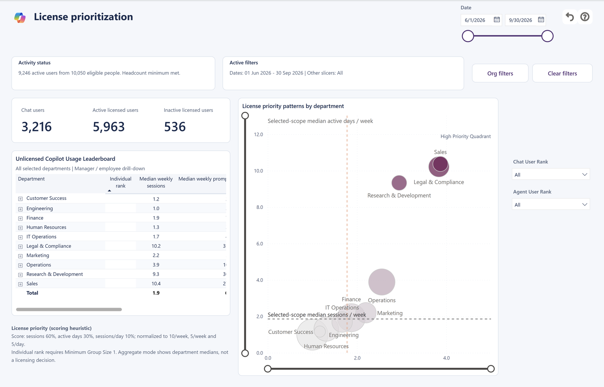

**What you'll see**
- **Chat users, licensed users and inactive licensed users** at a glance.
- **Unlicensed Copilot usage leaderboard:** departments ranked by how much people without a Microsoft 365 Copilot license use Copilot Chat, with median weekly sessions and active days.
- **License priority patterns:** each department plotted by how often and how regularly people use Copilot Chat. Departments toward the **High Priority** corner use it most.
- **How the score works:** sessions count for 60%, active days for 30% and sessions per day for 10%. The explanation is printed on the page.

> ⚖️ **Good to know:** Use this page to *start* a licensing conversation, alongside job needs, cost and feedback from colleagues. It doesn't decide who should receive a license. Department comparisons come first; individual rankings need an approved setting.

<a href="#top">⬆️ Back to top</a>

## 3 · 🔍 Copilot Overall: Combined Trends

> **The question it answers:** *How do M365 Copilot, Copilot Chat and agents compare over time?*

**What you'll see**
- **Agent users, chat users, licensed users and inactive licensed users** in one column.
- **Average sessions per user over time:** one line each for agents, unlicensed Copilot Chat and M365 Copilot.
- **Active users by department:** separate bars for each experience, not stacked totals.
- **Usage frequency and intensity:** a bubble chart of departments, with tabs to switch between agents, unlicensed Copilot Chat and M365 Copilot.

> ⚖️ **Good to know:** One person can use more than one experience, so these groups overlap. Compare them side by side rather than adding them together.

<a href="#top">⬆️ Back to top</a>

## 4 · 🔍 Copilot Overall: Combined Leaderboard

> **The question it answers:** *Which departments use each experience, and how many chat users also use agents?*

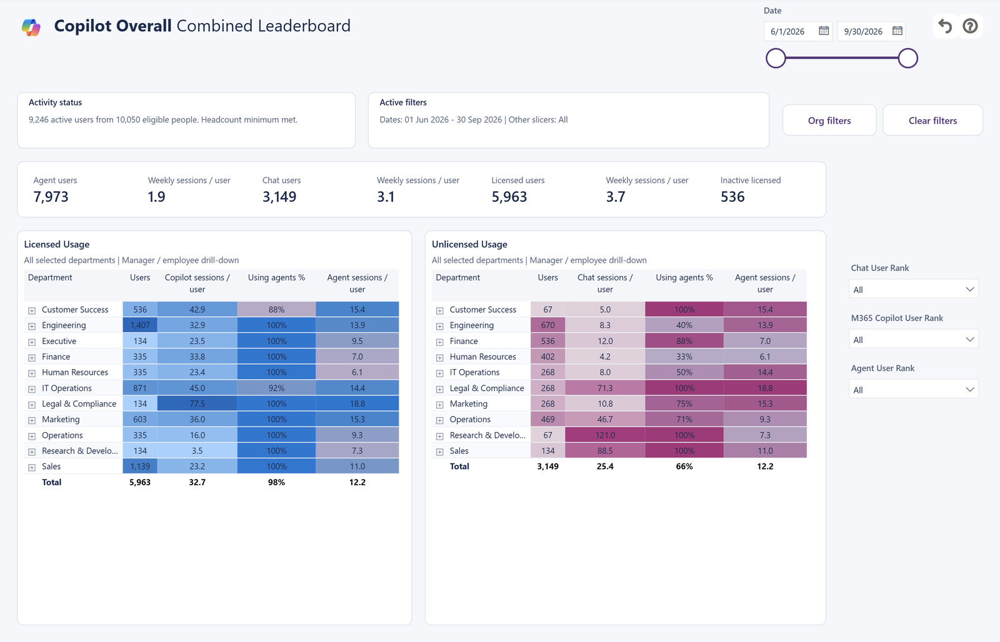

**What you'll see**
- **Licensed usage by department:** users, Copilot sessions per user, the share who also used agents, and agent sessions per user.
- **Unlicensed usage by department:** chat users, sessions per user and the share who also used agents.
- **Heat colors** that make the busiest departments easy to spot.

> ⚖️ **Good to know:** Each percentage answers one question: *of this table's chat users, how many also used agents?* People with unknown license information aren't counted as unlicensed. Department results come first; individual people appear only with an approved setting.

<a href="#top">⬆️ Back to top</a>

---

## 🤖 Agents

*Reach, habits, leaders, health and uses of every agent in your organization*

## 5 · 🤖 Agents: Usage Trends

> **The question it answers:** *How many people try agents, and how many come back?*

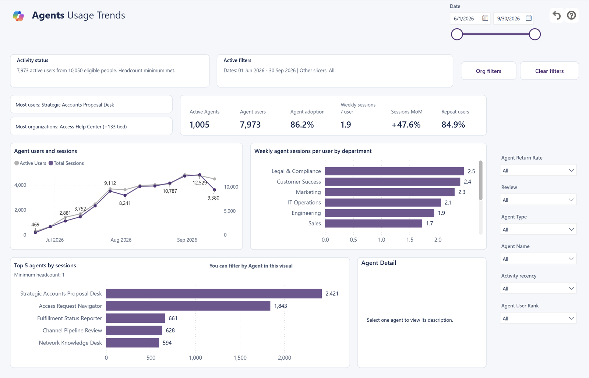

**What you'll see**
- **Most users** and **Most organizations:** which agents lead, with ties shown.
- **Headline numbers:** active agents, agent users, agent adoption, weekly sessions per user, month-over-month change in sessions and repeat users.
- **Agent users and sessions over time**, and **weekly agent sessions per user by department**.
- **Top 5 agents by sessions.** Select an agent to filter the page and see its description under **Agent Detail**.
- **Filters on the right** for return rate, review status, agent type, agent name, activity recency and user rank.

> 💡 **Try this:** Compare reach (people who tried an agent) with repeat use (people who came back) over several weeks, then open **Agent Details** to look closer at one agent.

<a href="#top">⬆️ Back to top</a>

## 6 · 🤖 Agents: Habit Formation

> **The question it answers:** *How often do people use agents in a month?*

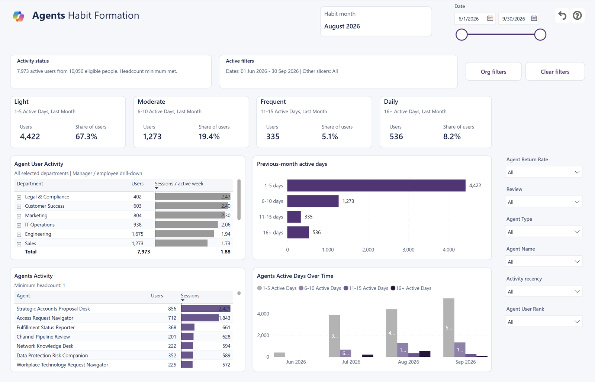

**What you'll see**
- **Habit month**, printed at the top. It's the month before the end of your selected date range.
- **Four habit cards:** Light (1–5 active days), Moderate (6–10), Frequent (11–15) and Daily (16 or more), each with the number and share of people.
- **Previous-month active days:** bars that compare the four groups directly.
- **Agent user activity by department** and **agent activity** tables for your whole selected period.
- **Agent active days over time:** how the habit mix changes month by month.

> ⚖️ **Good to know:** The cards and bars describe the printed habit month. The tables cover your whole selected period, so read them separately.

<a href="#top">⬆️ Back to top</a>

## 7 · 🤖 Agents: Leaderboard

> **The question it answers:** *Which agents, and which people, lead on sessions and prompts?*

**What you'll see**
- **Headline numbers:** catalog agents, active agents, high impact agents, dormant agents and repeat users.
- **Agents leaderboard:** each agent's type, users, organizations, sessions, prompts, prompts per session, sessions per user and return rate.
- **Agent user leaderboard,** which you can expand from agent to department, managers and, when approved, employees.
- **By agent** and **By user** buttons. **By user** appears only when individual detail is approved.
- **Agent features:** whether each agent uses SharePoint, OneDrive, Graph connectors, files and more.

> 💡 **Try this:** Sort by **prompts per session** to find agents that hold longer conversations, then select **Agent Details** to understand who uses them.

<a href="#top">⬆️ Back to top</a>

## 8 · 🤖 Agents: Health Check

> **The question it answers:** *Which agents should we keep, and which should we review with their owners?*

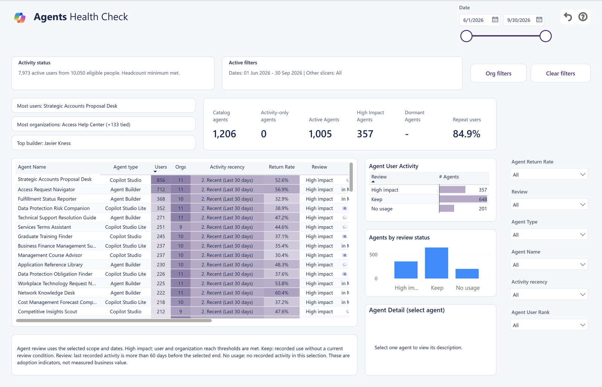

**What you'll see**
- **Every agent with a review label:** **High impact**, **Keep**, **Review** or **No usage**.
- **Activity recency:** agents grouped by how recently anyone used them.
- **Users, organizations and return rate** for each agent, following your team and date choices.
- **Agents by review status:** a chart of how many agents fall into each label.
- **Agent Detail:** select an agent to read its description.

> 💡 **Try this:** Choose a department and period, read the review explanation on the page, then talk through any surprising label with the agent's owner.

<a href="#top">⬆️ Back to top</a>

## 9 · 🤖 Agents: Use Cases

> **The question it answers:** *What might each agent be used for?*

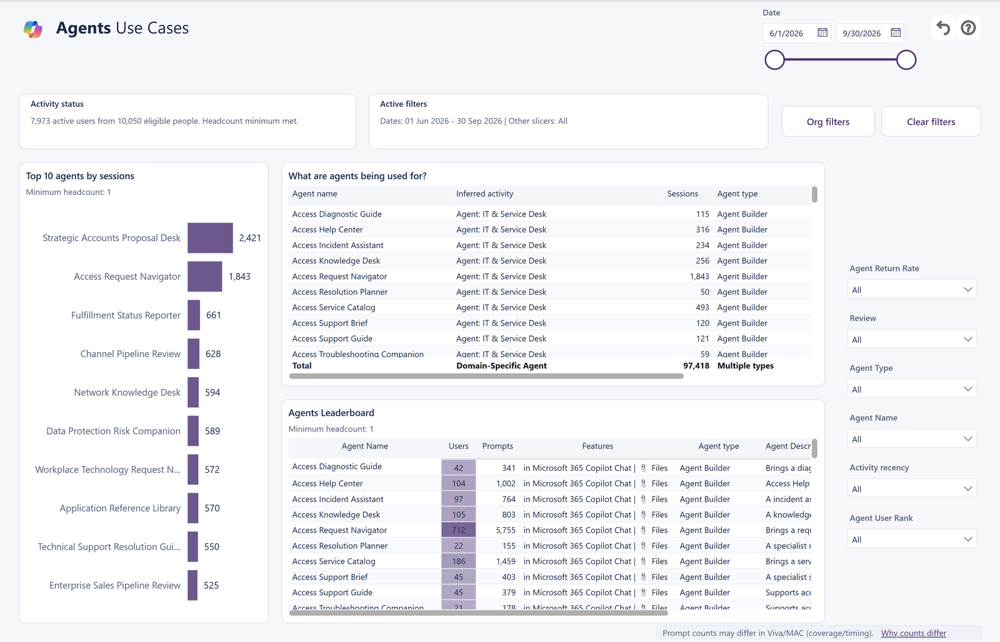

**What you'll see**
- **Top 10 agents by sessions.**
- **What are agents being used for?:** each agent with its likely activity categories, conversation counts and type.
- **Agents leaderboard:** users, prompts, listed capabilities, type and description.

> ⚖️ **Good to know:** Activity categories are clues, not measured outcomes. Choose an agent you know and check them with the people who use it.

<a href="#top">⬆️ Back to top</a>

## 10 · 🤖 Agent Details

> **The question it answers:** *Who uses this agent, how much, where, and do they come back?*

**What you'll see**
- **Agent picker:** starts with all agents; choose one or several.
- **Six headline numbers:** users, prompts, agent sessions, prompts per session, organizations and repeat users.
- **Daily prompts and sessions:** daily lines with bold 7-day averages.
- **Usage by organization:** which departments use the agent most.
- **Usage detail:** departments (and, when approved, people) with prompts, sessions, active days and last activity.

> 💡 **Two ways in:** Open the **Agent Details** tab to browse freely, or right-click an agent name on another page and choose **Drill through → Agent drillthrough**. From there, **Back** returns you to where you were and **Explore all agents** lets you pick another, keeping the same team and dates.

<a href="#top">⬆️ Back to top</a>

---

## 📈 M365 Copilot

*Use of licensed Microsoft 365 Copilot*

## 11 · 📈 M365 Copilot: Usage Trends

> **The question it answers:** *How is licensed Microsoft 365 Copilot use trending?*

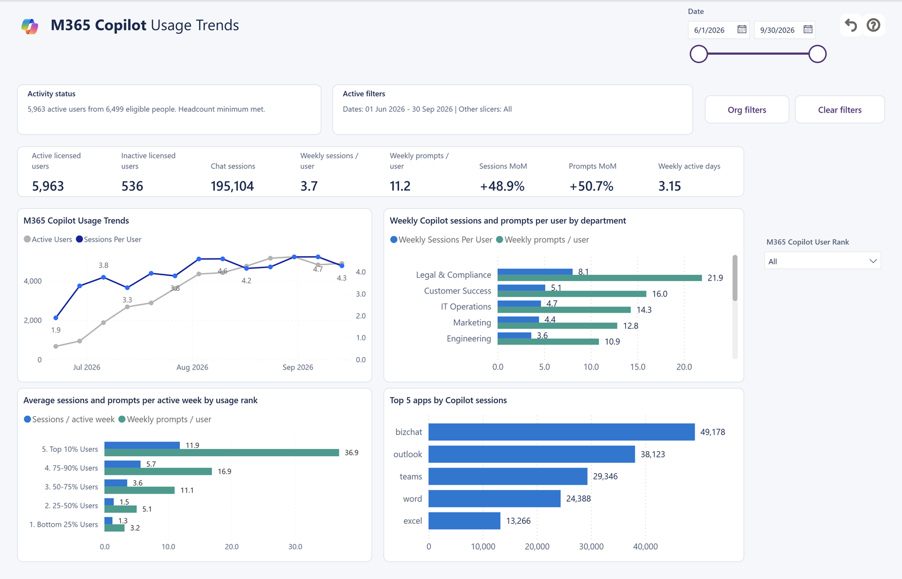

**What you'll see**
- **Headline numbers:** licensed users, inactive licensed users, Copilot sessions, weekly sessions per user, month-over-month change and weekly active days.
- **Usage trend:** active users and sessions per user, week by week.
- **Weekly sessions per user by department.**
- **Average sessions per active week by usage rank:** from the top 10% of users to the bottom 20%.
- **Top 5 apps by Copilot sessions,** such as Microsoft 365 Copilot Chat, Outlook, Teams and Word.

> ⚖️ **Good to know:** Look at users, sessions and apps together, and ask the team what explains a change before drawing conclusions about value.

<a href="#top">⬆️ Back to top</a>

## 12 · 📈 M365 Copilot: Habit Formation

> **The question it answers:** *Is licensed Copilot becoming a monthly habit?*

**What you'll see**
- **Habit month**, printed at the top: the month before the end of your selected date range.
- **Light, Moderate, Frequent and Daily cards,** using the same four active-day ranges as every habit page.
- **Previous-month active days:** bars comparing the four groups.
- **M365 Copilot user activity by department** for your whole selected period.
- **M365 Copilot active days:** the habit mix month by month.

<a href="#top">⬆️ Back to top</a>

## 13 · 📈 M365 Copilot: Leaderboard

> **The question it answers:** *Which departments and apps lead in licensed Copilot use?*

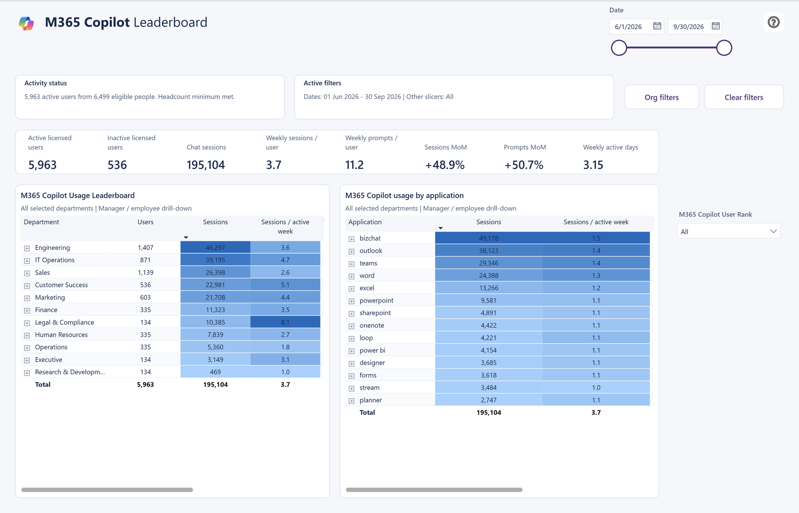

**What you'll see**
- **Usage leaderboard by department:** users, sessions and sessions per active week, with heat colors.
- **Usage by application:** expand an app to see its departments and, when approved, the people using it.
- **Rank filter** to focus on your most or least active users.

> 💡 **Try this:** Expand **Microsoft 365 Copilot Chat** (bizchat) and then a department to see where that app is used most.

<a href="#top">⬆️ Back to top</a>

---

## 📊 Copilot Chat

*Copilot Chat use by people without a Microsoft 365 Copilot license. These tabs are named **Chat (Web)** in the report.*

## 14 · 📊 Chat (Web): Usage Trends

> **The question it answers:** *How often do people without a Copilot license use Copilot Chat, and do they come back the same day?*

**What you'll see**
- **Headline numbers:** chat users, weekly sessions per user, month-over-month change and weekly active days.
- **Unlicensed chat usage trends** and **weekly chat sessions per user by department**.
- **Average sessions per active week by usage rank.**
- **Daily share of users with repeat sessions:** how many active people had more than one chat session that day.

> ⚖️ **Good to know:** More conversations can mean useful work, retries or a hard task. Read repeat use alongside the weekly pattern.

<a href="#top">⬆️ Back to top</a>

## 15 · 📊 Chat (Web): Habit Formation

> **The question it answers:** *Is Copilot Chat becoming a regular habit?*

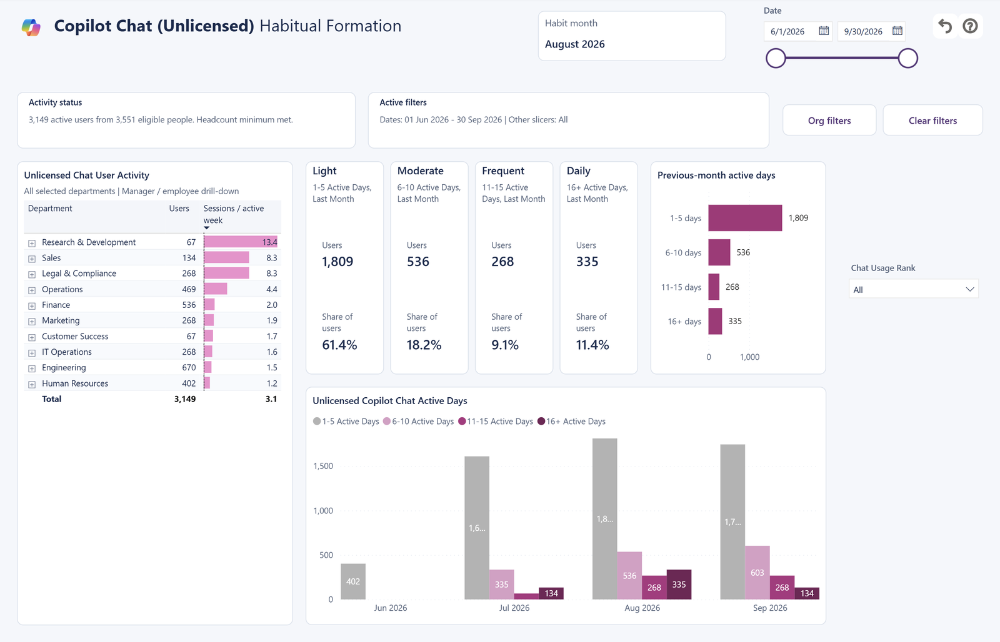

**What you'll see**
- **Habit month**, printed at the top.
- **Light, Moderate, Frequent and Daily cards,** with bars comparing the four groups.
- **Unlicensed chat user activity by department** for your whole selected period.
- **Unlicensed Copilot Chat active days:** the habit mix month by month.

<a href="#top">⬆️ Back to top</a>

## 16 · 📊 Chat (Web): Leaderboard

> **The question it answers:** *Which departments lead in Copilot Chat use, and how engaged are they?*

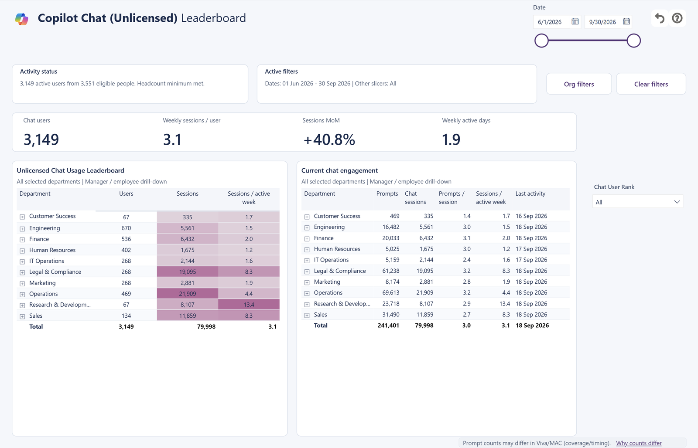

**What you'll see**
- **Unlicensed chat usage leaderboard by department:** users, sessions and sessions per active week.
- **Current chat engagement:** prompts, chat sessions, prompts per session, sessions per active week and last activity.

> ⚖️ **Good to know:** These pages count recorded chat only, not agents, Cowork or unclassified activity. Departments come first; individual people appear only with an approved setting.

<a href="#top">⬆️ Back to top</a>

---

## 17 · 📖 Metric Glossary & Guide

> **The question it answers:** *What does this number mean, and how should I read it?*

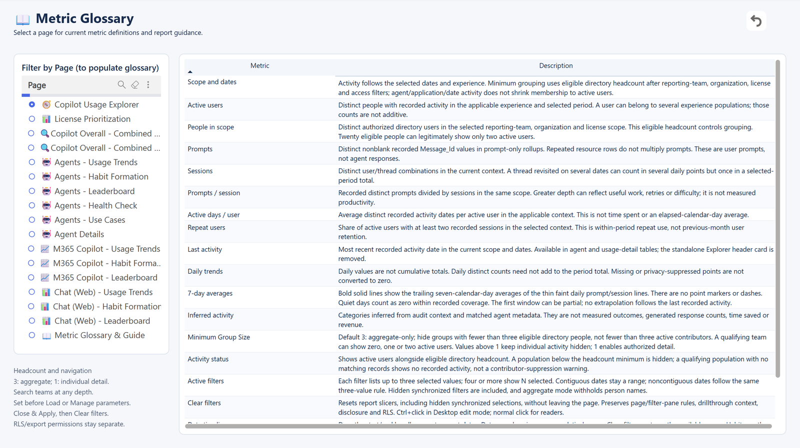

**What you'll see**
- **Filter by Page:** choose any of the 17 pages to see only the definitions you need. It opens on Copilot Usage Explorer.
- **Plain-language definitions** for every number and control. For example, *prompts* are requests, and *sessions* are conversations.
- **How to set Minimum Group Size,** both when you first open the template and later in Power BI Desktop.
- **The difference between grouping and access:** what a page displays versus who is allowed to see the data.

<a href="#top">⬆️ Back to top</a>

---

### 🚀 Ready to see your own data?

**[⬇️ Download the dashboard and set it up](README.md#-choose-your-edition)** &nbsp;·&nbsp; **[📘 Interpretation Guide](AI-in-One-v2.0.0-Interpretation-Guide.pdf)** &nbsp;·&nbsp; **[🎞️ Storyboard](AI-in-One-v2.0.0-Storyboard.pptx)**

Explore more free reports at **[aka.ms/Analytics-Hub](https://aka.ms/Analytics-Hub)**

Built and maintained by the **Microsoft Copilot Analytics team**.

